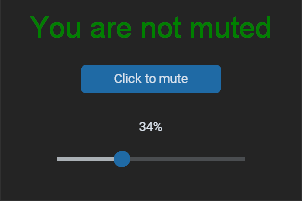
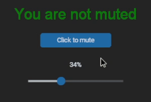
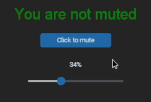
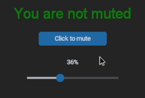

# Mute Your Microphone (Windows)

This program simplifies muting/unmuting and adjusting the volume of your microphone on **Windows**. It only targets the default microphone right now.

This is targeted towards people who have a microphone that lacks physical controls, reducing the need for navigating through Windows settings for these basic tasks.

## Prerequisites

- **Operating System**: Windows (Tested on Windows 10)
- **Python 3.7+** 

## How to Install and Run


1. Clone the repository to your local machine

```
git clone https://github.com/briansanchez1/Mute-Your-Mic.git
```

2. Navigate to project directory

```
cd your-repository
```

3. Install requirements

```
pip install -r requirements.txt
```

4. Run program

```
python MicrophoneControllerGui.py
```

# Usage

<p align="center">
  When you run the program will see the following:
<br/><br/>
  
</p>

<p align="center">
  Click the button to toggle mute and unmute:
<br/><br/>
  
 </p> 
 
<p align="center">
  Move the slider to adjust the volume:
<br/><br/>
  
</p>

<p align="center">
  Do a combination of the both:
<br/><br/>
  
</p>

# Contributing

Any contributions are welcome! Feel free to modify the code to fit your needs:

- **Bug Reports:** If you encounter any bugs or issues, please submit a detailed bug report with steps to reproduce
- **Feature Requests:** Have an idea for a new feature? Feel free to open a feature request and describe the functionality you'd like to see

#### Code Style and Standards

Please follow [PEP 8](https://www.python.org/dev/peps/pep-0008/) for Python code style

# License

This project is licensed under the MIT License. Read the [LICENSE](README.md) for more information.
